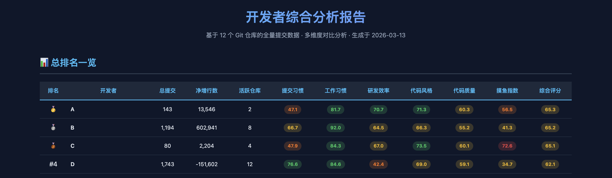
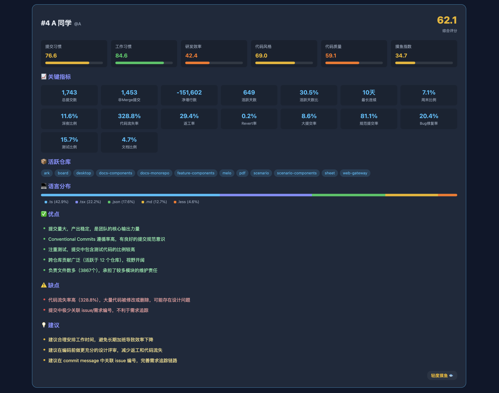

# 仓库可见的协作模式分析 Skill（零依赖、零脚本）

> 仓库提交历史里不会量化“谁努力谁不努力”，但它能告诉你一些仓库级信号：提交节奏、返工频率、文件热点、巴士因子风险。本技能把这些信号汇成一份仓库级报告，用于团队回顾与流程改进。它**不是**人事工具。

## 怎么用？

作为 Skill 插件使用。**触发激活的标准是显式且无歧义的**——请在请求中**同时包含**“明确的分析仓库意图 + 具体仓库路径 + Dry-Run 预览”。在团队仓库上运行前，请确认你有权分析该仓库、并已告知被分析的同事。

```
“请对 /Users/me/code/my-repo 这个 Git 仓库运行 who-is-actor，先 Dry-Run。”
“在 /Users/me/code/my-repo 上生成仓库协作模式报告。”
```

> 仅说“分析一下这个仓库的研发效率”“看看团队的参与度”“对比代码质量”这类泛泛描述，**代理不应自动开始采集**，而必须先与你确认仓库路径、权限、是否使用 Dry-Run，才会进入采集流程。

支持的参数：

| 参数 | 说明 | 默认值 |
|------|------|--------|
| `repo_path` | 仓库绝对路径 | **必填** |
| `since` | 开始日期（ISO 格式） | 仓库全部历史 |
| `until` | 结束日期（ISO 格式） | 仓库全部历史 |
| `branch` | 目标分支 | 当前活跃分支 |

> **不接受按贡献者过滤。** 本技能是仓库级别的，不提供 `authors` 参数，不会执行任何 `git log --author=...` 命令。如果你要求“只看某个人”，代理会拒绝并提供仓库级报告。




## 一切的起源：能不能不装东西？

市面上的 Git 分析工具，要么让你装 Python 包，要么让你跑 Node 脚本，要么直接甩一个 Docker 镜像。我只是想看看仓库的提交节奏与协作模式，结果光配环境就花了半小时。

我心想：Git 本身就是最好的数据库啊。 `git log` 里有提交时间、作者、改动行数、文件列表、commit message……这些数据足够描出一个仓库的完整协作模式。为什么非要装额外的东西？

于是 who-is-actor 诞生了 —— 一个**零依赖、零脚本**的 Git 仓库**协作模式分析**Skill。它只用原生的只读 `git` 命令和标准系统工具（`cut`、`sort`、`awk`、`grep` 等 —— 大多数系统已预装）采集指标，在本地进行脱敏与聚合，只将聚合后的数值传给 AI 生成报告。

> **重要定位：** 本技能产出的是仓库级协作模式报告，**不是**开发者个人画像、不是绩效评分。报告严禁用于人事决策。

> **"零依赖"的意思是：** 不装 pip 包、不装 npm 模块、不跑自定义脚本。但它**需要**这些标准系统工具已在你的机器上：`git`、`cut`、`sort`、`uniq`、`awk`、`grep`、`sed`、`wc`、`head`（macOS / Linux 默认自带，Windows 请用 Git Bash 或 WSL）。

## 它能看到什么？

六个**仓库级**模式维度（都是整仓库只算一次，不拆到人头上）：

| 维度 | 它在看什么 |
|------|-----------|
| 📝 **仓库级提交习惯** | 仓库整体提交频率、改动范围、commit message 长度与约定式合规率。 |
| ⏰ **仓库级提交时间分布** | 提交集中的时段、周末比例、跨度与连续性。 |
| 🚀 **仓库级流失与返工信号** | 整体净增长、流失率、同文件 7 天窗口返工频率。 |
| 🎨 **仓库级提交消息与 Issue 关联** | 是否遵循 Conventional Commits、是否关联 Issue。 |
| 🔍 **仓库级质量信号** | Bug fix 提交占比、revert 频率、大提交比例。 |
| 📊 **仓库级可见活动指数** | 只映射仓库整体在 Git 里能看见的活动水平（原叫“参与度指数”）。**不是**个人参与度、生产力、投入度的度量，**不会**按贡献者拆分，**不得**用于人事决策。 |
## 报告中可能出现的模式（示例）

> 以下是为了让你明白报告长什么样子而列出的**示意性模式**。报告本身描述的是仓库中出现的**提交模式**，而不会为具体个人贴上人设标签。同一组指标背后可能是你不知道的上下文。
### 🌙 深夜/周末提交集中的模式

```
Peak Hour:        23:00
Weekend Ratio:    78.6%
Late Night Ratio: 57.1%
Churn Rate:       43.7%
```

提交集中在深夜与周末，伴随较高的流失率。可能的所有读法都成立：白天被会议填满、项目迭代期本身偏周末、个人作息偏晚、重构阶段多次调整。适合拿出来问“我们该怎么调”，不适合用来说“他怎么了”。

### 📦 集中的大提交 + 低流失率的模式

```
Total Lines Added:  84,224
Large Commit Ratio: 50.0%
Ownership Ratio:    100.0%
Churn Rate:         0.0%
```

仓库中出现一次性大范围提交、后续几乎不走动的区域，常见于初始化提交、主干迁入、仅一人维护的模块。Ownership 100% 意味着该区域只有一位贡献者，是需要补一补知识转移的**巴士因子风险**信号。

### ⚡ 高周末比例 + 低流失率 + 低返工率的模式

```
Weekend Ratio:  66.7%
Churn Rate:     3.8%
Rework Ratio:   7.7%
```

提交集中在周末，但改动稳定、置换少。可能对应于：设计阶段在工作日完成、实现阶段在周末集中落地；也可能只是个人作息偏好。这些仅仅是假设，不是结论。
### 👻 低频但不可忽视的贡献

```
Total Commits:  1
Active Span:    1 day
```

只出现过一次的贡献者。Git 能告诉你提交只有一次，但告诉不了你这次提交背后是十分钟还是三周。报告不会也不应该从提交数量推断“贡献价值”。

## 核心设计：零依赖怎么做到的？

### 架构

整个分析流程像一条极简流水线：

```
用户明确触发 (带仓库路径) → 参数白名单校验 → (推荐) Dry-Run 预览
  → 白名单内的只读 git 命令采集 (原始输出 = 本地数据)
  → 本地脱敏与聚合 (提交主题/文件路径在此完成数值化)
  → 仅将聚合后的数值指标传给 AI 模型 → 生成仓库级报告
```

没有 Python，没有 Node，没有 pip install，没有 npm install。所有数据采集仅靠这些命令：

```bash
# 仓库贡献者数量（仅用于多样性/巴士因子计算，不采集邮箱）
git shortlog -sn --all | wc -l

# 仓库级提交时间分布（分析仓库整体工作习惯）
git log --pretty=format:"%aI" | cut -c12-13 | sort | uniq -c

# 仓库级增删行统计
git log --pretty=tformat: --numstat | awk '{ add += $1; subs += $2 } END { printf "added: %s, deleted: %s\n", add, subs }'

# 仓库级 Bug Fix 提交计数
git log --grep="fix\|bug\|hotfix" --oneline -i | wc -l

# 仓库级 Conventional Commits 合规计数
git log --pretty=format:"%s" | grep -cE "^(feat|fix|chore|docs|style|refactor|test|perf|ci|build)(\(.+\))?:"
```

AI 拿到**这些本地聚合后的数值指标**（计数、平均值、比率、扩展名直方图）后，负责解读、计算指标、生成仓库级点评。**原始提交消息文本与完整文件路径仅在本地处理，不会出现在发送给 AI 的提示中。**

### 安全设计

**命令白名单机制：** 本 Skill 仅允许执行预定义的 git 只读命令（包括 `git rev-parse --is-inside-work-tree`、`git rev-parse --show-toplevel`、`git shortlog -sn --all`、`git log ...`、`git diff --stat ...`），严禁任何写入操作（`git push/commit/merge`）、非 git 命令（`curl/python/node`）、文件写入（`> / >>`）和网络操作（`git fetch/pull/clone`）。管道 `|` 仅允许连接 `cut`、`sort`、`uniq`、`awk`、`grep`、`wc`、`sed`、`head` 等只读文本处理工具。

**输入校验：**

所有用户输入在拼接到 shell 命令前，都必须通过严格的白名单校验：

| 参数 | 校验规则 |
|------|---------|
| **仓库路径** | 必须是绝对路径，不含 `;`  `\|`  `&`  `$` ` ` ` ` ` 等危险字符，且通过 ` git rev-parse` 验证为合法仓库 |
| **日期** | 严格 ISO 格式： `^[0-9]{4}-[0-9]{2}-[0-9]{2}$` |
| **分支名** | 白名单： `^[a-zA-Z0-9/_.-]+$` ，不含 `..` |

> **注：本技能已移除 `authors` 参数，不接受作者名输入，也不执行任何包含 `--author=...` 的 git 命令。以前需要作者名白名单的场景已不复存在。

校验失败的参数会被拒绝或降级处理，**绝不会未经验证直接执行**。

**预览模式（Dry-Run）：** 首次使用时推荐说"先列出要执行的命令，不要运行"，代理会展示所有将要执行的命令供你审查，确认无误后再实际执行。

**敏感数据保护：** 提交消息默认仅在本地进行统计处理（长度计算、关键词匹配），**完整的提交消息文本不会发送给 AI 模型**，只发送聚合后的指标。此外，所有文本在离开本地环境前会自动脱敏以下模式：API 密钥、令牌、AWS 密钥、私钥、数据库连接字符串等。详见 SKILL.md 中的"Sensitive Data Filtering Rules"。

**仓库作用域限制：** 代理仅访问用户提供的特定仓库路径，不会遍历父目录或访问仓库以外的文件系统。

**执行验证协议：** 由于本技能是纯指令型（无可执行代码），安全规则依赖代理正确执行。首次使用前，建议在测试仓库上运行验证：1) 使用 dry-run 确认所有命令在白名单内；2) 故意输入无效值（含 `;` 的路径、含 `@` 的作者名）验证拒绝行为；3) 确认代理只发送聚合指标而非原始提交消息。详见 SKILL.md 中的"Enforcement Verification Protocol"。

此外，本工具**不采集开发者邮箱**，所有 git 命令仅使用作者名（ `%an` ）标识开发者。

### 可见活动指数怎么算的？

这是一个**仓库级**指数（不拆到人头上），综合五个仓库级信号，加权计算出 0-100 分（越低代表仓库整体在 Git 上可见活动越高）：

| 信号 | 权重 | 逻辑 |
|------|------|------|
| 仓库级日均提交极低（<0.3） | 25% | 仓库整体可见提交节奏低 |
| 仓库级活跃天数占比低（<30%） | 20% | 时间跨度大但实际有提交的天数少 |
| 仓库级代码净增长极低或为负 | 20% | 在分析区间内删除多于新增 |
| 平均 Commit message 较短（<15字符） | 15% | 仓库提交主题较短——注意：短消息本身并不必然是坏事 |
| 仓库级高流失率 + 高返工率 | 20% | 在分析区间内仓库整体有较高的反复修改模式 |

等级对照表（描述仓库，不是描述任何人）：

| 分数 | 等级 | 说明 |
|------|------|------|
| 0-20 | 🏆 仓库整体高可见活动 | 高提交量**不是**生产力评判；可能意味着团队层面需关注可持续性 |
| 21-40 | 💪 仓库稳定可见活动 | 提交节奏较为稳定 |
| 41-60 | 😐 仓库中等可见活动 | 仅用于讨论起点，不足以下结论 |
| 61-80 | 🤔 仓库低可见活动 | 大量工作可能发生在被分析分支之外、代码评审、设计、辅导、值班、文档中 |
| 81-100 | ❓ 仓库极低可见活动 | 原因可能多种（项目暂停、在其他分支/仓库进行、以不同身份提交、主要为非代码工作等）；代理**不得**据此推论出对任何具名贡献者的判断 |

> **重要提醒：** 本指数仅基于 Git 提交记录计算，无法反映代码评审、架构设计、技术讨论、团队指导、值班、客户调研等不产生提交记录的工作。**它不是**参与度、投入度、生产力的度量。

> **⚠️ 用途约束（对代理）：** 本指数是仓库属性、不会拆到人头上，**严禁**被代理或使用者用于绩效考核、招聘/解雇、裁员、薪酬调整、排名或任何人事决策。若被要求作此类用途，代理必须拒绝。

### 关于"加权综合评分"——明确不做

为了避免本工具被误用为个人评分系统，**报告不会**对任何个人产出加权综合评分、雷达图分数、排名位次或一句话犀利总结。所有维度的指标均仅以仓库级聚合数值展示，姓名仅作为 Git 提交归属标签出现。

如果你看到任何报告产出包含按人加权的综合分、雷达图评分、最佳/最差表现者排名，说明它**没有**遵循本技能的伦理使用政策。代理应拒绝此类用法并改回仓库级、非评判的工作流程模式描述。

## 生成的报告长什么样？

### 仓库活动概览（单行，仓库级）

| 仓库 | 总提交数 | 增/删行数 | 日均提交 | 活跃日% | 周末% | 深夜% | Bug Fix% | 流失率 | 可见活动区间 |
|------|---------|----------|---------|--------|-------|-------|----------|-------|-------------|
| `<repo_name>` | 213 | +107,894 / -2,993 | 1.6 | 38.0% | 21.4% | 12.7% | 5.5% | 16.7% | 28 |

> 以上是**仓库整体**的单行概览。报告**不会**按贡献者拆行、**不会**产出“综合评分”、**不会**列出“最佳/最差贡献者”或任何针对个人的排名。可见活动区间是仓库的属性，不是任何个人的属性。

### 仓库级工作流程观察（例示）

报告描述的是**整个仓库**的可见模式，而不会针对具体个人贴人设标签。常见示例：

- “仓库在分析区间内采取主干直推的工作模式，平均提交主题长 17 字符、Conventional Commits 合规率 62%。”
- “仓库出现多次大提交（>500 行），伴随较低的同文件 7 天返工率 — 可能意味着存在初始化迁入、大型重构或零零散散补上的场景。”
- “周末提交比例 21.4%，高于一般仓库水平。全面原因不足以仅从 Git 上看到——可作为团队节奏/发布窗口/跨时区讨论的起点。”

上述句型都是仓库级描述，不是任何个人的评判。

### 文件级巴士因子披露（唯一会出现贡献者名字的地方）

```
⚠️ bus-factor 提醒：以下文件在分析区间内历史仅归属于一位作者，建议安排知识转移与评审轮换：
  - core/auth/session.ts — 唯一历史作者：Alice
  - infra/billing/legacy_adapter.go — 唯一历史作者：Bob
```

这里出现名字的唯一目的是帮用户知道该找谁安排知识转移。报告**不会**在这里附加任何节奏、流失、返工、周末比例等评估性指标，也不会对这些贡献者作出任何行为性点评。
## 写在最后：数据不是审判

必须坚诚地说：**这个工具不是用来搞绩效考核的。代理应拒绝任何要求它作为人事依据的使用。**

那个凌晨三点提交代码的同事，也许是白天被会议填满的；那个 commit message 只写 "fix" 的人，也许正在争分夺秒修复线上事故；那个只贡献了一个提交的人，也许是花整一周读懂代码才动的手。

可见活动指数高分的人，可能只是在做那些 Git 记录不了的事 —— 设计方案、技术评审、帮新人答疑、在白板前画了一下午的架构图。

写这个工具的初心，是想让仓库代码的使用习惯能被看见，让团队能基于事实聊天。它是一面供你看、供你讨论的镜子，**不是代你判人的法官**。

代码会说话，但只有用心听，才能听到正确的答案。

---

*技术栈：原生 Git + AI —— 就这么简单*

*开源协议：MIT —— 拿去用，但请遵从其伦理使用政策*

*⚠️ 可见活动指数仅基于 Git 提交数据，不反映非代码贡献，**严禁**作为绩效考核依据。*
